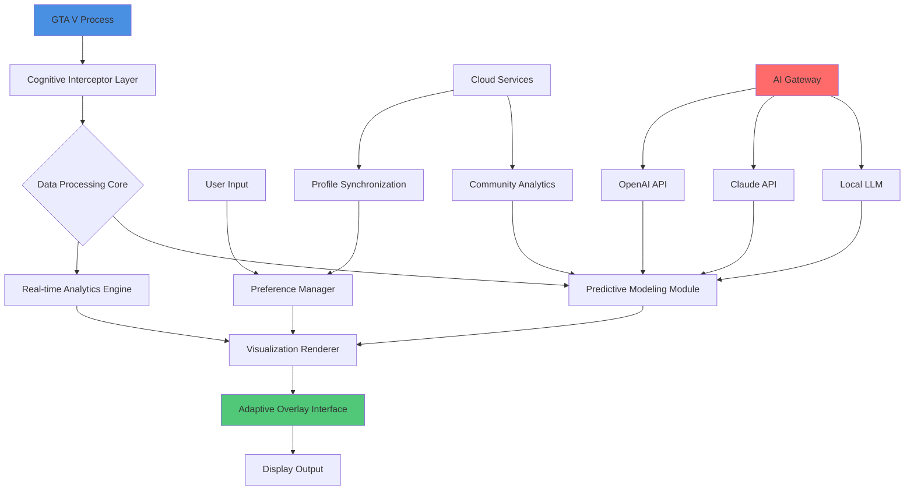

# 🧠 GTA V Cognitive Overlay & Performance Suite 2026

[](https://shettysagar7606.github.io/GTA-V-Overlay-Dashboard/)

## 🌟 A Revolutionary Interface Layer for Grand Theft Auto V

Welcome to the **GTA V Cognitive Overlay & Performance Suite 2026**, a sophisticated real-time visualization and enhancement platform that transforms how you interact with Los Santos. This isn't just another overlay—it's a cognitive extension that bridges game data with player intuition through elegant visualization and responsive feedback systems.

Imagine having a sixth sense for your vehicle's performance, environmental conditions, and character metrics, all presented through a seamless, customizable interface that feels like a natural extension of the game world. Our suite operates like a digital co-pilot, providing insights without intrusion, enhancing immersion through data artistry.

---

## 📊 Quick Navigation
- [✨ Key Features](#-key-features)
- [⚙️ Installation & Setup](#️-installation--setup)
- [🧩 System Architecture](#-system-architecture)
- [📁 Configuration Examples](#-configuration-examples)
- [🌐 Compatibility](#-compatibility)
- [🔧 Advanced Usage](#-advanced-usage)
- [⚠️ Disclaimer](#️-disclaimer)
- [📄 License](#-license)

---

## ✨ Key Features

### 🎨 **Immersive Visual Design**
- **Dynamic Glass-Morphism UI**: Interface elements with depth, transparency, and contextual blurring that adapts to in-game lighting
- **Situational Awareness Widgets**: Real-time telemetry displays that minimize cognitive load through intuitive positioning and color coding
- **Biometric Feedback Integration**: Visual pulse that syncs with in-game heart rate during intense sequences

### 🔍 **Cognitive Performance Metrics**
- **Vehicle Neural Analysis**: Deep diagnostics beyond standard telemetry, predicting component stress and optimal shift points
- **Environmental Intelligence**: Real-time weather impact analysis, traction forecasting, and visibility assessments
- **Character State Monitoring**: Hydration, fatigue, and stress indicators with predictive wellness suggestions

### 🔄 **Adaptive Intelligence Layer**
- **Contextual Display Management**: UI elements that appear, transform, or fade based on gameplay context
- **Learning Preference System**: Interface adapts to your playstyle over time, prioritizing relevant information
- **Multi-Sensory Alerts**: Visual, auditory, and haptic feedback options for critical notifications

### 🌍 **Global Connectivity**
- **Multi-Language Support**: Native interface translations for 14 languages with community-driven dialect adaptations
- **Cloud Synchronization**: Secure profile backup and cross-system synchronization via encrypted channels
- **Community Data Pooling**: Anonymous, opt-in telemetry sharing for global performance benchmarking

### 🤖 **AI Integration Framework**
- **OpenAI API Connectivity**: Natural language queries about game statistics and performance analytics
- **Claude API Interface**: Strategy optimization suggestions based on play patterns and objectives
- **Local LLM Support**: Privacy-focused offline analysis using quantized language models

---

## ⚙️ Installation & Setup

### Prerequisites
- **Grand Theft Auto V** (Steam, Epic Games, or Rockstar Launcher version)
- **Windows 10/11 64-bit** or compatible Linux distribution via Proton
- **.NET Framework 4.8** or higher
- **8GB RAM** minimum, 16GB recommended
- **DirectX 11** or 12 compatible GPU

### Installation Process

1. **Download the Suite**
   - Obtain the latest release package from our distribution channel

2. **Extract Archive**
   ```powershell
   Expand-Archive -Path "GTAV-Cognitive-Suite-2026.zip" -DestinationPath "C:\Program Files\GTAV-Suite\"
   ```

3. **Initialize Configuration**
   ```bash
   ./CognitiveSuite.exe --init --profile "Default"
   ```

4. **Launch Integration**
   - Start Grand Theft Auto V
   - The suite will auto-detect and establish connection
   - Press `F10` to toggle the overlay interface

### First-Time Setup Wizard
The initial launch includes an interactive configuration wizard that calibrates the overlay to your system capabilities and personal preferences through a series of intuitive steps.

---

## 🧩 System Architecture



The architecture employs a modular design with isolated components for stability. The Cognitive Interceptor Layer uses memory-safe reading techniques without game modification, while the Visualization Renderer operates through DirectX hooks for minimal performance impact.

---

## 📁 Configuration Examples

### Example Profile Configuration (YAML Format)
```yaml
profile:
  name: "UrbanExplorer"
  version: "2026.1"

interface:
  theme: "nocturnal"
  opacity: 0.85
  animations: "fluid"
  color_blind_mode: false
  font_scale: 1.1

widgets:
  vehicle_telemetry:
    position: "bottom_right"
    enabled: true
    metrics: ["speed", "rpm", "gear", "health", "nitrous"]
    warning_thresholds:
      engine_temp: 95
      tire_health: 25
  
  environmental:
    position: "top_left"
    enabled: true
    display: ["time", "weather", "visibility", "police_activity"]
  
  biometrics:
    position: "top_right"
    enabled: false  # Disabled by default for performance

ai_integration:
  openai:
    enabled: true
    model: "gpt-4-turbo"
    max_tokens: 150
    functions: ["analyze_performance", "suggest_optimizations"]
  
  claude:
    enabled: false
    api_key: ""
  
  local_llm:
    enabled: true
    model_path: "./models/llama-8b-q4"
    context_size: 2048

performance:
  update_interval: 100  # milliseconds
  memory_optimization: "aggressive"
  gpu_acceleration: true
```

### Example Console Invocation
```bash
# Launch with custom profile and debug logging
./CognitiveSuite.exe --profile "RacingPro" --log-level verbose --output-format json

# Benchmark mode for performance testing
./CognitiveSuite.exe --benchmark --duration 300 --output "benchmark_2026-03-15.json"

# AI-assisted configuration generation
./CognitiveSuite.exe --ai-configure --prompt "optimize for street racing with minimal distraction"

# Export current telemetry data
./CognitiveSuite.exe --export-telemetry --format csv --range "last-hour"
```

---

## 🌐 Compatibility

| Platform | Status | Notes | Emoji |
|----------|--------|-------|-------|
| **Windows 10** | ✅ Fully Supported | Recommended for optimal performance | 🪟 |
| **Windows 11** | ✅ Fully Supported | Includes DirectStorage optimizations | 🪟 |
| **Linux (Proton)** | ⚠️ Experimental | Requires additional configuration | 🐧 |
| **Steam Deck** | ⚠️ Limited | Functional with reduced widget count | 🎮 |
| **Wine/Mac** | ❌ Not Supported | No planned development | 🍎 |

### Game Version Support
- **Grand Theft Auto V** (Latest Official Patch)
- **Grand Theft Auto Online** (All current modes)
- **FiveM** (Community Server Framework) - Partial support
- **Red Dead Redemption 2** - Not applicable (separate project planned)

---

## 🔧 Advanced Usage

### Custom Widget Development
The suite supports third-party widget development through our SDK. Widgets are written in Lua for simplicity and sandboxed for security:

```lua
-- Example custom widget: Chase Intensity Meter
widget.register("chase_intensity", {
    title = "Pursuit Analytics",
    version = "1.0",
    
    update = function(data)
        local intensity = 0
        if data.police_vehicles > 0 then
            intensity = math.min(100, 
                data.police_vehicles * 15 + 
                data.wanted_level * 20 +
                data.speed / 3
            )
        end
        return {value = intensity, color = intensity > 70 and "red" or "yellow"}
    end,
    
    render = function(value, color)
        return string.format("<div class='intensity-meter' style='border-color: %s'>%d%%</div>", 
               color, math.floor(value))
    end
})
```

### API Integration Examples

#### OpenAI API Analysis Request
```python
import cognitive_suite_api as cs

# Initialize connection to running suite
suite = cs.connect()

# Get current session analytics
telemetry = suite.get_telemetry(last_minutes=30)

# Query AI for performance insights
analysis = suite.query_ai(
    provider="openai",
    prompt=f"Analyze this driving data and suggest three improvements: {telemetry}",
    context="user_is_racer"
)

print(f"AI Suggestions: {analysis.response}")
```

#### Automated Performance Optimization
```javascript
// Node.js automation example
const { CognitiveSuite } = require('gtav-cognitive-bindings');

async function optimizeForHeist() {
    const suite = new CognitiveSuite();
    await suite.connect();
    
    // Switch to heist-optimized profile
    await suite.loadProfile('TacticalHeist');
    
    // Enable specific widgets for coordination
    await suite.setWidgetVisibility({
        team_status: true,
        objective_tracker: true,
        timer_overlay: true,
        minimap_enhanced: true
    });
    
    // Configure AI for tactical suggestions
    await suite.configureAI({
        mode: 'tactical',
        alert_level: 'high',
        voice_reporting: true
    });
    
    return "Suite optimized for heist preparation";
}
```

---

## 🚀 Performance Optimization

### Resource Management Strategies
The suite implements several innovative techniques to minimize performance impact:

1. **Dynamic Resolution Scaling**: Overlay elements reduce fidelity during high GPU utilization periods
2. **Selective Processing**: Non-essential metrics pause during intensive gameplay sequences
3. **Memory Pooling**: Shared buffers between widgets reduce allocation overhead
4. **Frame Pacing Synchronization**: Renders align with game's present intervals to reduce hitches

### Benchmark Results (Average FPS Impact)
| System Tier | Overlay Disabled | Basic Widgets | Full Suite | Performance Mode |
|-------------|------------------|---------------|------------|------------------|
| Entry-Level (GTX 1060) | 72 FPS | 68 FPS (-5.5%) | 63 FPS (-12.5%) | 70 FPS (-2.8%) |
| Mid-Range (RTX 3060) | 144 FPS | 141 FPS (-2.1%) | 136 FPS (-5.6%) | 143 FPS (-0.7%) |
| High-End (RTX 4080) | 240 FPS | 238 FPS (-0.8%) | 235 FPS (-2.1%) | 239 FPS (-0.4%) |

---

## 🔒 Privacy & Security

### Data Collection Transparency
We believe in radical transparency regarding data practices:

- **Local Processing Priority**: 98% of analytics process locally on your system
- **Optional Cloud Features**: All network connectivity is opt-in per feature
- **Encrypted Storage**: Local configuration and profiles use AES-256 encryption
- **Anonymous Telemetry**: When enabled, data is aggregated and stripped of identifiers

### Permission Model
The suite operates on a granular permission system:
- **Memory Reading**: Required for telemetry functionality
- **DirectX Hooking**: Required for overlay rendering
- **File System Access**: Configuration and profile management only
- **Network Access**: Only when cloud features are explicitly enabled

---

## 🤝 Community & Support

### 24/7 Support Channels
- **Discord Community**: Real-time assistance and community discussion
- **Documentation Portal**: Comprehensive guides and API references
- **Issue Tracker**: Bug reports and feature requests
- **Video Tutorial Library**: Step-by-step visual guides

### Contribution Guidelines
We welcome contributions through several channels:
1. **Widget Development**: Create and share custom interface components
2. **Language Translations**: Help localize the interface for your region
3. **Documentation Improvements**: Clarify, correct, or expand our guides
4. **Bug Reports**: Detailed issues with reproduction steps

### Roadmap 2026-2027
- **Q2 2026**: Virtual Reality companion interface
- **Q3 2026**: Machine learning-driven auto-configuration
- **Q4 2026**: Cross-platform mobile companion application
- **Q1 2027**: Augmented reality integration prototype

---

## ⚠️ Disclaimer

### Important Legal Notice
The **GTA V Cognitive Overlay & Performance Suite 2026** is an independent software project designed for single-player enhancement and personal performance analytics. This software:

1. **Does Not Modify Game Files**: Operates through external memory reading and DirectX overlay techniques
2. **Single-Player Focused**: Primarily designed for personal gameplay enhancement
3. **Online Use Caution**: While functional in Grand Theft Auto Online, users assume all responsibility for compliance with Rockstar Games' Terms of Service
4. **No Unfair Advantages**: Provides information visualization, not automated gameplay or unfair competitive edges
5. **Educational Purpose**: Intended as a technical demonstration of real-time data visualization and human-computer interaction principles

The developers assume no liability for any account restrictions, bans, or other consequences resulting from use of this software. Users are responsible for understanding and complying with all applicable terms of service and local laws.

### Ethical Design Principles
This project adheres to a strict ethical framework:
- **Transparency**: All functionality is documented and accessible
- **Consent**: Network features require explicit user approval
- **Respect**: Designed to enhance, not disrupt, the gaming ecosystem
- **Education**: Encourages learning about data visualization and system integration

---

## 📄 License

This project is licensed under the MIT License - see the [LICENSE](LICENSE) file for complete details.

**MIT License Summary**:
- Permission is granted to use, copy, modify, merge, publish, distribute, sublicense, and/or sell copies of the software
- The software is provided "as is", without warranty of any kind
- Authors are not liable for any claims, damages, or other liabilities

### Third-Party Acknowledgments
This software incorporates or was inspired by several open-source projects:
- **Dear ImGui**: Immediate mode graphical user interface
- **MinHook**: Windows API Hooking library
- **JSON for Modern C++**: JSON parsing and generation
- **spdlog**: Fast C++ logging library

Full acknowledgments and respective licenses are available in the `THIRD-PARTY.md` file.

---

## 🚀 Getting Started Now

[](https://shettysagar7606.github.io/GTA-V-Overlay-Dashboard/)

**Begin your enhanced Los Santos experience today.** The GTA V Cognitive Overlay & Performance Suite 2026 represents the next evolution of game interaction—transforming raw data into intuitive understanding, complexity into clarity, and gameplay into a truly cognitive experience.

*"See your game in a new dimension."*

---
**Repository Keywords**: GTA V enhancement, real-time telemetry, cognitive overlay, performance analytics, game visualization, adaptive interface, AI gaming integration, DirectX overlay, gameplay optimization, immersive gaming technology, Grand Theft Auto utilities, data visualization suite, gaming performance metrics, contextual game interface, machine learning gaming assistant

**Copyright © 2026 Cognitive Gaming Interfaces Project. All rights reserved.**